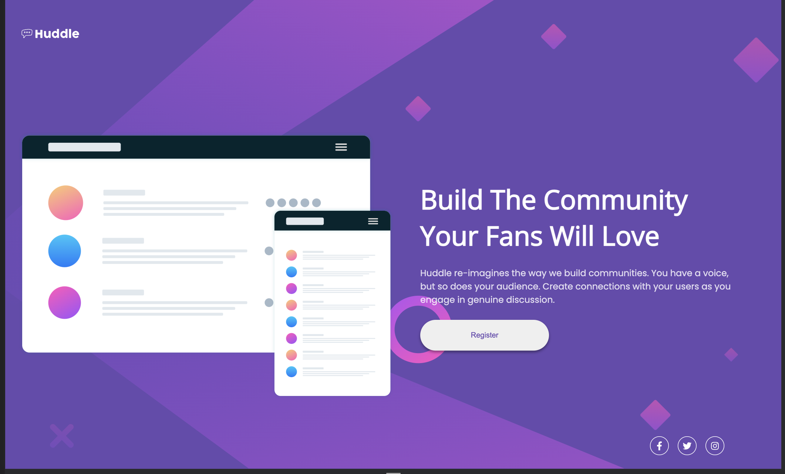

# Frontend Mentor - Huddle landing page with single introductory section solution

This is a solution to the [Huddle landing page with single introductory section challenge on Frontend Mentor](https://www.frontendmentor.io/challenges/huddle-landing-page-with-a-single-introductory-section-B_2Wvxgi0). Frontend Mentor challenges help you improve your coding skills by building realistic projects. 

## Table of contents

- [Overview](#overview)
  - [The challenge](#the-challenge)
  - [Screenshot](#screenshot)
  - [Links](#links)
- [My process](#my-process)
  - [Built with](#built-with)
  - [Continued development](#continued-development)
- [Author](#author)

## Overview

### The challenge

Users should be able to:

- View the optimal layout for the page depending on their device's screen size
- See hover states for all interactive elements on the page

### Screenshot

#### Mobile

#### Desktop

### Links

- Solution URL: [Solution URL](https://github.com/Kamania/huddle-landing-page-with-single-introductory-section-master)
- Live Site URL: [Live site URL](https://main--eclectic-blini-9e7397.netlify.app/)

## My process

### Built with

- Semantic HTML5 markup
- CSS custom properties
- Flexbox
- CSS Grid
- Mobile-first workflow

### Continued development

Implement next version using bootstrap 5

## Author

- Frontend Mentor - [@Kamania](https://www.frontendmentor.io/profile/Kamania)
- Twitter - [@Josephkamania](https://twitter.com/Josephkamania)